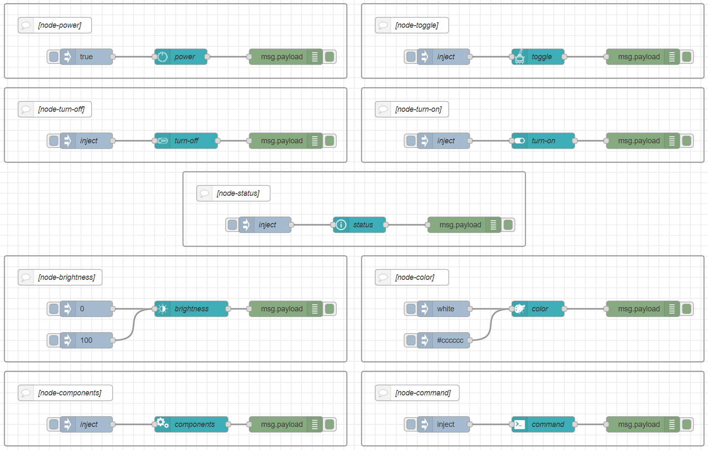

# node-red-contrib-tapo-new-api

Unofficial node-RED node for connecting to TP-Link Tapo devices with new interface (KLAP) and previous one (PASSTHROUGH). Currently limited to the:
- P100, P105, P110, P115 smart plugs
- L510E, L530E smart bulbs
- L900-10 smart strip



## Node command options

- **power**

    

    This node command provides the ability to power (on / off) the device by input `"msg.payload"` (boolean)

- **toggle**

    

    This node command provides the ability to toggle (on / off) the power of tapo smart plugs.

- **turn-on**

    

    This node command provides the ability to power on tapo smart plugs.

- **turn-off**

    

    This node command provides the ability to power off tapo smart plugs.

- **brightness**

    

    This node command provides the ability to set the brightness of tapo smart bulbs.

- **color**

    

    This node command provides the ability to set the color of tapo smart bulbs.

- **status**

    

    This node command provides the ability to get the device infomation of tapo smart plugs. Models that can monitor energy acquire energy information.

    `"output: msg.payload.tapoDeviceInfo, msg.payload?.tapoEnergyUsage(P110 only)"` will provide the device information and usage (if device can measure energy).

## Node configuration by message (`msg`)

You can always override the node command configuration by means of the following message properties:
  - `"msg.config.command"` takes an string with one of the following valid command options
    ```typescript
    type command_type = "status" | "power" | "on" | "off" | "toggle" | "color" | "brightness";
    ```
  - `"msg.config.version"` takes a number indicating the protocol 
  
    (1 - PASSTHROUGH, 2 - KLAP, 3 - AUTO)

  - `"msg.config.verbose"` takes a boolean indicating the error verbose.

    When verbose is selected a `"msg.payload.errorInf.track"` object is included.

  - `"msg.config.terninal_random"` takes a boolean indicating the terminal to use.

    When terminal_random is `true` a random terminal valid UUID is used (useful when various buttons are configured to attack same device).

## Pre-requisites

The node-red-contrib-tapo-new-api requires `Node-RED 15.0.0 or higher` to be installed.

## Install

```cmd
npm install node-red-contrib-tapo-new-api
```

## Usage

- Properties

  

  - **Name**

    Set the node name displayed in the flow.

  - **Email**

    Set the email address registered with Tp Link.

  - **Password**

    Set the password registered with Tp Link.

  - **Protocol**

    Set the protocol to be used in the communication with Tapo device.

  - **Command**

    Set the kind of command the node will take as initial configuration.

  - **Search mode**

    Select a search mode for the tapo device.

    **Usage**
    - ip : search by ip. (It's fast.)
    - alias: search by alias and ip range.

  - **Tapo ipaddress(`selected: ip`)**

    Set the IP address to the Tapo device.

  - **Tapo alias(`selected: alias`)**

    Set the tapo device alias registered with Tp Link.

  - **Tapo find ip range(`selected: alias`)**

    Set the IP range to search for Tapo device.

    **Usage**
    - case1: "192.168.0.1 to 192.168.0.25"
    - case2: "192.168.0.0/24"

### Inputs

`msg`

```typescript
type search_mode_type = "ip" | "alias";
type command_type = "status" | "power" | "on" | "off" | "toggle" | "color" | "brightness";

type config {
    email: string;
    password: string;
    deviceIp: string;
    deviceAlias: string;
    deviceIpRange: string;
    searchMode : search_mode_type;
    command?: command_type; /* Default: "status" */
    version?: TapoProtocolType; /* Default: AUTO */
    verbose?: boolean; /* Default: false */        
}

type payload: boolean /* power */ || string /* color */ || number /* brightness */
```

**[example1]**

```javascript
msg.config = {
  "email": "your@gmail.com",
  "password": "password",
  "deviceIp": "192.168.0.xxx",
  "command": "power",
  "version": 3 /* AUTO */
}
msg.paylaod = true;
```

**[example2]**

```javascript
msg.config = {
  "email": "your@gmail.com",
  "password": "password",
  "deviceIp": "192.168.0.xxx",
  "command": "toggle",
  "version": 2, /* KLAP */
  "verbose": true
}
```

**[example3]**

```javascript
msg.config = {
  "email": "your@gmail.com",
  "password": "password",
  "deviceIp": "192.168.0.xxx",
  "command": "color"
}
msg.paylaod = "white";
```
### Outputs

The processing result is passed by msg.payload. It consists of an object that contains the following properties:

```typescript
type TapoResuls = {
    result: boolean; /* true: success, false: failure */
    tapoDeviceInfo?: TapoDeviceInfo; /* Tapo device infomation */
    tapoEnergyUsage?: TapoDeviceInfo | undefined; /* Tapo device energy if compatible */ 
    errorInf?: Error;
}
```

**[smart plug device infomation]**

You can tell if the device is on or off by getting "device_on".

```text
true: smart plug power on
false: smart plug power off
```

```javascript
{
    result: true,
    tapoDeviceInfo: {
      device_id: "*************"
      fw_ver: "1.2.10 Build 20200609 Rel. 33394"
      hw_ver: "1.0.0"
      type: "SMART.TAPOPLUG"
      model: "P105"
      mac: "XX-XX-XX-XX-XX-XX"
      hw_id: "*************"
      fw_id: "*************"
      oem_id: "*************"
      specs: "JP"
      device_on: false
      on_time: 0
      overheated: false
      nickname: "3d printer power supply"
      location: "XXXXXXXXXXXXXXXX"
      avatar: "plug"
      time_usage_today: 0
      time_usage_past7: 0
      time_usage_past30: 0
      longitude: 0
      latitude: 0
      has_set_location_info: true
      ip: "192.168.0.XXX"
      ssid: "SSID"
      signal_level: 0
      rssi: 0
      region: "Europe/Madrid"
      time_diff: 0
      lang: "es_ES"
    },
    tapoEnergyUsage: {
      ????
    }
}
```

## npm-scripts

There are some npm-scripts to help developments.

- npm install - Install the testing environment in your project.
- npm run build - Make `./data/my-node` directory from the `src` directory and Install the my-node in Node-RED.
- npm run start - Start Node-RED. `"http://localhost:1880"`

## File tree

  ```text
  [root]
  │  package.json
  │  README.md
  │  tsconfig.json
  │
  ├─data -> `Node-Red work files`
  │  │  
  │  ├─my-node -> `project files` The resource files and built files should be placed here.
  │  │  │  package.json
  │  │  │
  │  │  └─nodes -> The resource files and built files should be placed here.
  │  │     └─...
  │  │
  │  └─node_modules
  │     └─...
  │
  ├─dist -> `The project built files`
  ├─examples -> `node-RED flow files`
  ├─figs
  └─src
      └─nodes -> project files
          ├─icons
          ├─lib
          ├─locales
          │  ├─en-US
          │  └─ja
          └─test
  ```
